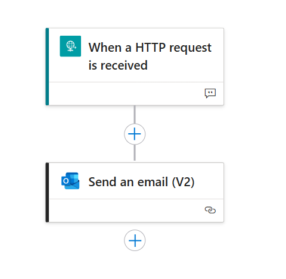
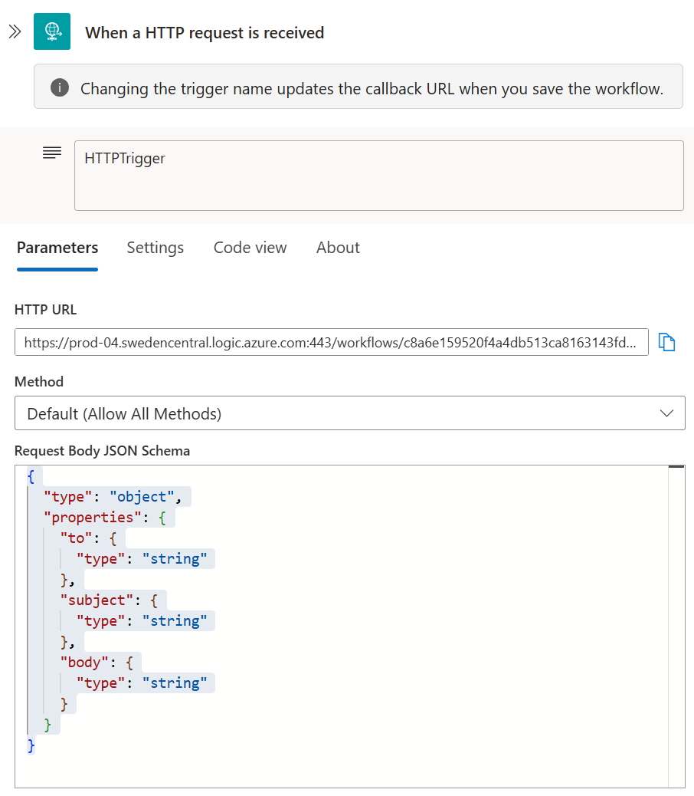
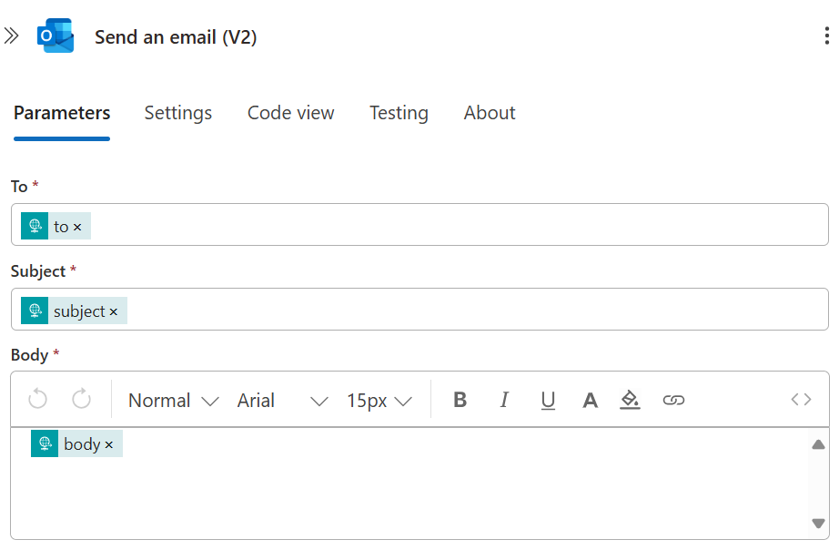
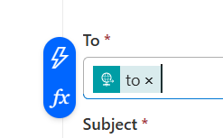

# Orchestrated Agents with Tools

Learn how to connect your agent teams to external APIs, services, and cloud workflows. This is where your agents start working with real-world data and systems.

## What's In This Folder

**[04.1 - OpenAPI Currency Exchange](04.1-openapi_currency_exchange_tutorial.ipynb)**
Connect your agents to the Frankfurter currency exchange API using OpenAPI specifications. Compare the Azure AI Foundry SDK approach with Semantic Kernel integration patterns.


**[04.2 - Hybrid OpenAPI + Plugins](04.2-hybrid_openapi_and_plugins_tutorial.ipynb)**
Build enterprise solutions that combine external APIs with local business logic. Create banking scenarios using local account data and external currency rates.


**[04.3 - Logic Apps Integration](04.3-logic_apps_hybrid_tutorial.ipynb)**
Integrate Azure Logic Apps workflows with AI agent intelligence. Build automated business processes with email notifications and workflow triggers.

## Learning Path

1. **Start with 04.1** - Master external API integration fundamentals
2. **Progress to 04.2** - Learn hybrid architectures
3. **Complete with 04.3** - Integrate cloud workflows

**Prerequisites**: Complete [01-agent-basics](../01-agent-basics/), [02-agent-custom-functions](../02-agent-custom-functions/), and [03-orchestrated-agents](../03-orchestrated-agents/).

## Prerequisites

### Previous Knowledge
- Complete all previous tutorial folders (01, 02, 03)
- Understanding of REST APIs and JSON
- Familiarity with agent orchestration patterns

### Azure Resources
- Azure subscription with sufficient permissions
- Azure AI Foundry project
- Deployed AI model (GPT-4, GPT-3.5-turbo, etc.)
- Azure OpenAI resource (for Semantic Kernel scenarios)
- Azure Logic Apps (for workflow automation scenarios)

### Environment Setup
- Python 3.8+
- Jupyter Notebook or VS Code
- Azure CLI (recommended)
- Network access to external APIs (Frankfurter, etc.)


### Set up the Logic App on AzureAdd commentMore actions

Please follow the [documentation](https://learn.microsoft.com/en-us/azure/ai-foundry/agents/how-to/tools/logic-apps?pivots=portal) link. The final Logic App should look like this:



When creating the trigger, please copy and paste the below in the "Request Body JSON Schema" field:

```json
{
  "type": "object",
  "properties": {
    "to": {
      "type": "string"
    },
    "subject": {
      "type": "string"
    },
    "body": {
      "type": "string"
    }
  }
}
```

The trigger step should look like this:




When creating the second step `Send an email (V2)`, please fill in the required fields as shown below:



The `to`, `subject`, and `body` fields will be available to populate from the previous step, which is the trigger. The `to` field will be used to send the email to the user, and the `subject` and `body` fields will be used to populate the email subject and body respectively. To add these fields, right-click on the "To*" field for example, then click on the blue lightning icon, and then select the proper value from the list of available fields. The final step should look like this:



Please note that the `Send an email (V2)` action in the Logic App requires a valid email address to send notifications, and the user has to **manually** go through authentication in the Azure Portal when adding this Step to the workflow. You can use your own email address or create a test email account for this purpose.

The final details in the Jupyter notebook will look like this (or similar):

```python 
# Logic App details
logic_app_name = "agent-logic-apps" # Resource name of the Logic App in Azure
trigger_name = "When_a_HTTP_request_is_received" # Trigger name for the Logic App
```

**Note**: The Logic App requires manual authentication in the Azure Portal for email sending capabilities.

**Final configuration** for the Jupyter notebook:
```python 
logic_app_name = "agent-logic-apps"  # Your Logic App resource name
trigger_name = "When_a_HTTP_request_is_received"  # Trigger name
```

### Environment Variables
Configure your Azure AI services in the `.env` file at the project root:

```bash
# Navigate to the project root and edit the .env file
cd ../../  # Go to azure-ai-agents-playbook root
```

Update the `.env` file with your Azure AI project details:
```properties
# Required for all tutorials
PROJECT_ENDPOINT="https://your-foundry-resource.services.ai.azure.com/api/projects/your-project-name"
MODEL_DEPLOYMENT_NAME="your-model-deployment-name"

# Required for Semantic Kernel scenarios (04.1, 04.2)
AZURE_OPENAI_API_KEY="your-azure-openai-api-key"
AZURE_OPENAI_ENDPOINT="https://your-openai-resource.openai.azure.com/"
AZURE_OPENAI_CHAT_DEPLOYMENT_NAME="your-chat-deployment"
AZURE_OPENAI_DEPLOYMENT_NAME="your-deployment-name"
AZURE_OPENAI_API_VERSION="2024-12-01-preview"

# Required for Logic Apps integration (04.3)
AZURE_SUBSCRIPTION_ID="your-subscription-id"
AZURE_RESOURCE_GROUP_NAME="your-resource-group-name"
```

**Tip**: The `.env` file already exists in the project root with example values - just update it with your details.

### Required Packages
Install the packages you need:

```bash
pip install azure-ai-agents azure-identity semantic-kernel azure-mgmt-logic requests python-dotenv
```
cd ../../  # Go to azure-ai-agents-playbook root
# Edit .env file with your Azure AI configuration
```

The `.env` file should contain your Azure AI project details:
```properties
# Required for all tutorials
PROJECT_ENDPOINT="https://your-foundry-resource.services.ai.azure.com/api/projects/your-project-name"
MODEL_DEPLOYMENT_NAME="your-model-deployment-name"

# Required for Semantic Kernel scenarios (04.1, 04.2)
AZURE_OPENAI_API_KEY="your-azure-openai-api-key"
AZURE_OPENAI_ENDPOINT="https://your-openai-resource.openai.azure.com/"
AZURE_OPENAI_CHAT_DEPLOYMENT_NAME="your-chat-deployment"
AZURE_OPENAI_DEPLOYMENT_NAME="your-deployment-name"
AZURE_OPENAI_API_VERSION="2024-12-01-preview"

# Required for Logic Apps integration (04.3)
AZURE_SUBSCRIPTION_ID="your-subscription-id"
AZURE_RESOURCE_GROUP_NAME="your-resource-group-name"

```

**Tip**: The `.env` file already exists in the project root with example values - just update it with your details.

### Required Packages
Install the packages you need:

```bash
pip install azure-ai-agents azure-identity semantic-kernel azure-mgmt-logic requests python-dotenv
```

## What You'll Learn

### Tool Integration Approaches

**OpenAPI Tool Integration**
- Use `OpenApiTool` with standardized API specifications
- Integrate external services like currency exchange APIs
- Handle automatic parameter mapping and documentation

**Hybrid Plugin + API Architecture**
- Combine Semantic Kernel plugins with external APIs
- Mix local business logic with external data sources
- Build secure enterprise applications

**Workflow Automation Integration**
- Integrate Azure Logic Apps with AI decision-making
- Create business process automation workflows
- Build notification and approval systems

### What You'll Build
- Currency Exchange Agent with real-time rates
- Banking Assistant (local data + external APIs)
- Business process automation with email notifications
- Multi-source intelligence systems

## Next Steps

After mastering external tool integration:
- [05-orchestrated-agents-with-custom-openapi-tools](../05-orchestrated-agents-with-custom-openapi-tools/) - Custom API services
- [06-magentic-one-orchestration](../06-magentic-one-orchestration/) - Advanced orchestration patterns
